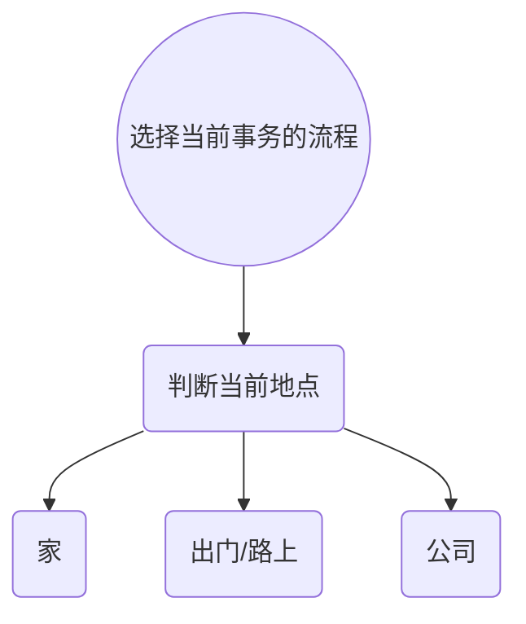

```mermaid
graph TD
	start((选择当前事务的流程))
	selectPlace(判断当前地点)
	home(家)	
	click home "../home"
	
	onTheWay(出门/路上)
	workplace(公司)
	
	start-->selectPlace
	selectPlace-->home	
	selectPlace-->onTheWay
	selectPlace-->workplace
	

	
```

