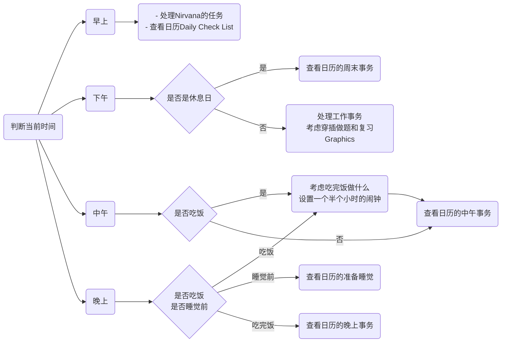

### 需要注意的点

- 看Terrace House或许是个有效的学习日语和提升做事欲望的方法：注意总结学到的日语词汇
- 早起很重要

```mermaid
graph LR
	selectTime(判断当前时间)
	morning(早上)
		mtask("- 处理Nirvana的任务<br/> - 查看日历Daily Check List")
		
	noon(中午)
		snoon{是否吃饭}
		beforeLaunch(考虑吃完饭做什么<br/>设置一个半个小时的闹钟)
		afterLaunch(查看日历的中午事务)
		
	afternoon(下午)
		safternoon{是否是休息日}
		weekend(查看日历的周末事务)
		weekday(处理工作事务<br/>考虑穿插做题和复习Graphics)
	evening(晚上)
		sevening{是否吃饭<br/>是否睡觉前}
		beforeSleep(查看日历的准备睡觉)
		afterdinner(查看日历的晚上事务)
	
	selectTime-->morning
	selectTime-->afternoon
	selectTime-->noon
	selectTime-->evening
	
	morning-->mtask
	
	noon-->snoon
	snoon-->|是|beforeLaunch
	snoon-->|否|afterLaunch
	beforeLaunch-->afterLaunch
	
	afternoon-->safternoon	
	safternoon-->|是|weekend
	safternoon-->|否|weekday
	
	evening-->sevening
	sevening-->|吃饭|beforeLaunch
	sevening-->|睡觉前|beforeSleep
	sevening-->|吃完饭|afterdinner
```