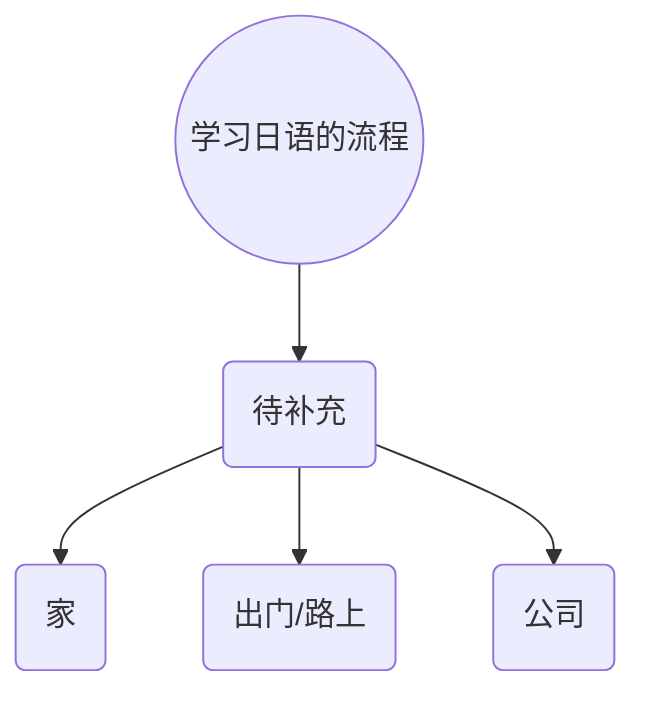

### 学习日语的要点（实验中）

- 每天中午晚上吃完饭学习
  - 现在20200417：有文法和读解的课程要学习，每天2课
  - 完成之后周末全部复习一下，写完每课的练习
  - 平时注意日语词汇和说法的积累=》尝试添加到Onenote的Inbox，周末整理
- 可能在Notion里面tracking进度（日语学习计划）
- 日语笔记的Onenote也需要整理一下

```mermaid
graph TD
	start((学习日语的流程))
	selectPlace(待补充)
	home(家)	
	click home "../home"
	
	onTheWay(出门/路上)
	workplace(公司)
	
	start-->selectPlace
	selectPlace-->home	
	selectPlace-->onTheWay
	selectPlace-->workplace
```

